Joshua Mundt

02/21/2020

Project 2

  The purpose of this project is to request one year data from OOI website[1] for oregon self surface mooring [2] and oregon offshore surface mooring [3]. The bulk meteorology instrument package is selected to analyze the rain rate and wind speed with respect to time. 
  
 
From Oregon Shelf Surface Mooring, wind speed & rain rate vs time

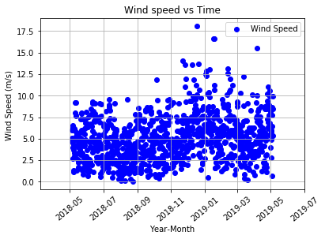
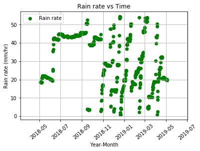

From Oregon Offshore Surface Mooring, wind speed & rain rate vs time

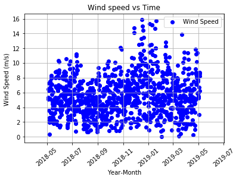
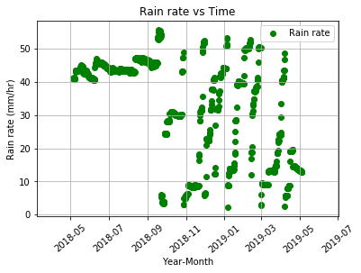

(Left image) Oregon Shelf Surface Mooring---------- & -----------(Right Image) Oregon Offshore Surface Mooring

1. Not Rainy and Not Windy

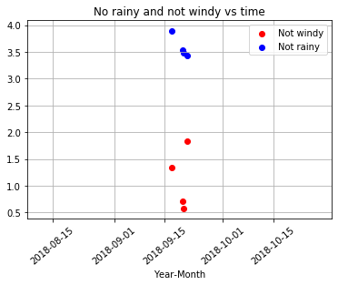
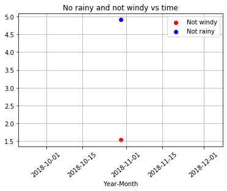

2. Not Rainy and Windy

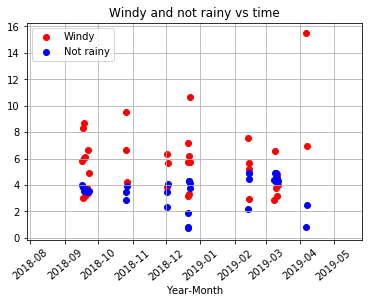

3. Rainy and Not Windy

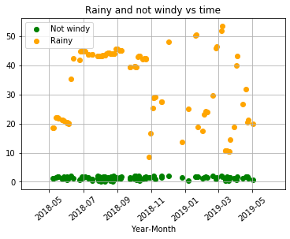
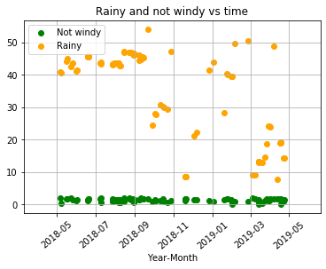

4. Rainy and Windy

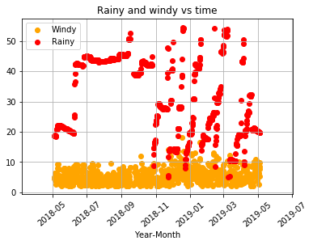
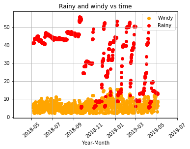

The monthly average of the wind speed and rain ratefor each site

(Left image) Oregon Shelf Surface Mooring----------- & ------------(Right Image) Oregon Offshore Surface Mooring

1. Average Wind Speed Vs. Months

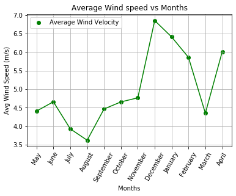
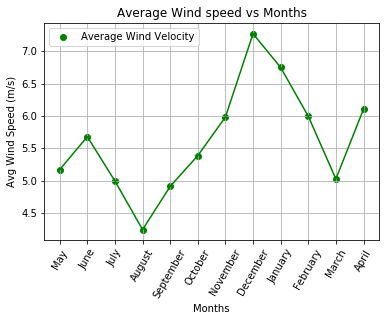

2. Average Rain Rate Vs. Months

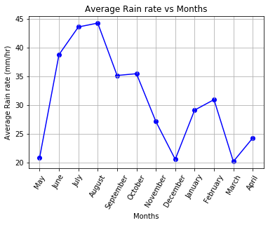
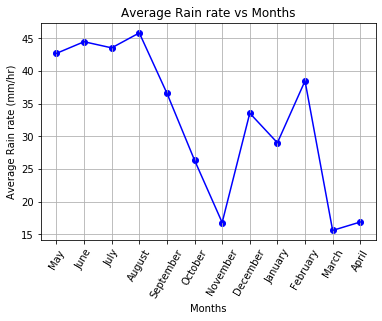

conclusion

 

References

[1]https://oceanobservatories.org/instrument-series/metbka/

[2]https://oceanobservatories.org/site/ce02shsm/

[3]https://oceanobservatories.org/site/ce04ossm/

[4]https://github.com/ooi-data-review/m2m_demo/blob/master/notebooks/json_data_request.ipynb

[5]https://currents.soest.hawaii.edu/ocn_data_analysis/_static/SEM_EDOF.html?fbclid=IwAR0ggSwiHOAAuvjzATIryUESpMfoYr2jnvurXC4oYLCPAdAYMpU_XupDp8E
