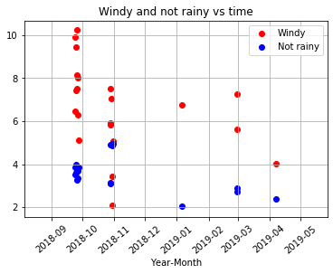

Joshua Mundt

02/21/2020

Project 2

  The purpose of this project is to request one year data from OOI website [1] using M2M method [4] for oregon shelf surface mooring [2] and oregon offshore surface mooring [3]. The bulk meteorology instrument package is selected to analyze the rain rate and wind speed with respect to time. Also, this assignment will teach students how to append data and plot the cross- correlation [5] between two different sites in a span of one year to analyze wind speed and rain rate. Then, show which month has the highest/lowest rain rate and wind speed to make comparisoin between two sites.
  
For the images below, I considered not rainy if the rain rate was less than 5mm per hour and not windy if the wind speed was less than 2m/s.
  
 
From Oregon Shelf Surface Mooring, wind speed & rain rate vs time

From Oregon Offshore Surface Mooring, wind speed & rain rate vs time

(Left image) Oregon Shelf Surface Mooring---------- & -----------(Right Image) Oregon Offshore Surface Mooring

1. Not Rainy and Not Windy

2. Not Rainy and Windy

3. Rainy and Not Windy

4. Rainy and Windy

---------------------The monthly average of the wind speed and rain rate for each site--------------------------

(Left image) Oregon Shelf Surface Mooring----------- & ------------(Right Image) Oregon Offshore Surface Mooring

1. Average Wind Speed Vs. Months

The images above indicate that both locations had similar average wind speed trend between May 2018 and May 2019. The lowest average wind speed was in August and the highest average wind speed was in December for both sites. Both locations received highest wind speed in the winter, followed by spring, fall, and summer.

2. Average Rain Rate Vs. Months

The images above show that the lowest average rain rate was in March 2019 and the highest average rain rate was in August 2018 for both locations. The biggest discrepency was shown in the early months, where Oregon Shelf's rain rate was significatly lower compare to its counterpart. Both locations had the highest rain rate in summer, followed by fall, winter, and spring.

------------------------------------------Cross- correlation -----------------------------------------------------

When plotting cross-correlation between wind speed at both sites, as seen in the left figure, the maximum correlation was about 0.64, thus the lag did not occur. One location can be used as a model to estimate the wind speed for the other site, since the datasets were highly correlated.

The right figure illustraed that the maximum correlation between rain rate at both locations was about 0.39. Hence, the lag occured at 55, which is equivalent to 20 days. Ths means oregon Shelf surface lags oregon offshore surface by 20 days.

The data showed that Oregon Shelf Surface Mooring and Oregon Offshore Surface Mooring shared simlilar wind speed trend through out the year, where the maximum wind speed occured in the winter and minumum wind speed occured during the summer. However, when analyzing the rain rate of both location, the correlation between the two datasets are low and the plots suggested that both location received the maximum rain rate during summer time and the least rain rate in spring. There is no relationship between the time lag of wind speed and rain rate other than there was high correlation for the wind speed and 20 days lag for rain rate.

 

References

[1]https://oceanobservatories.org/instrument-series/metbka/

[2]https://oceanobservatories.org/site/ce02shsm/

[3]https://oceanobservatories.org/site/ce04ossm/

[4]https://github.com/ooi-data-review/m2m_demo/blob/master/notebooks/json_data_request.ipynb

[5]https://currents.soest.hawaii.edu/ocn_data_analysis/_static/SEM_EDOF.html?fbclid=IwAR0ggSwiHOAAuvjzATIryUESpMfoYr2jnvurXC4oYLCPAdAYMpU_XupDp8E
